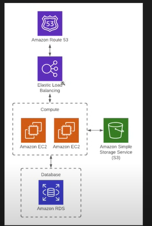

# Azure Load-Balanced WebApp with Terraform

## Overview
This repository contains Terraform code to deploy a **basic load-balanced web application** in **Azure**. This setup is inspired by the traditional **3-tier AWS architecture**, but implemented using Azure services instead.

## Architecture Implemented
- **Load Balancer (LB):** Distributes traffic to multiple virtual machines.
- **Two Virtual Machines (VMs):** Running Apache web server, initialized via `custom_data`.
- **Azure DNS Zones:** Used for custom domain name resolution.
- **Azure Storage Account:** Used for storing static assets or configurations.

## Features & Terraform Techniques Used
1. **Apache Web Server Initialization:**
   - Used the `custom_data` argument to install and start Apache web server automatically on the Linux VMs.
2. **Terraform Lifecycle Management:**
   - Utilized `lifecycle` arguments to manage infrastructure state effectively.
3. **Dynamic Resource Management:**
   - Implemented `for_each` and `count` parameters to dynamically create resources as needed.
4. **Output Configuration:**
   - Displayed the public IP of the Load Balancer as an output for easy access.
5. **Terraform Modules & Data Blocks:**
   - Used the `data` block to fetch existing Azure resources.
   - Implemented the `module` block to call the **staging module** from the global folder, ensuring reusable infrastructure components.

## Future Enhancements
1. **Use GitHub Actions to automate CI/CD** for streamlined deployments.
2. **Use remote state** to store Terraform state files in **Azure Storage backend** for easier collaboration.
3. **Parameterize configurations** by using variables instead of hardcoding values.
4. **Avoid using Terraform provisioners** and switch to tools like **Ansible** for better configuration management.

